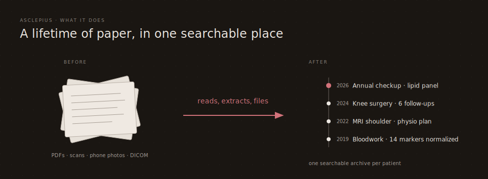
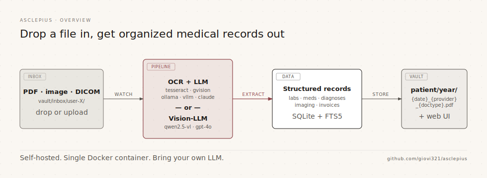

<p align="center">
  
</p>

<h1 align="center">Asclepius</h1>

<p align="center">
  <a href="https://github.com/giovi321/asclepius/actions/workflows/ci.yml"></a>
  <a href="https://github.com/giovi321/asclepius/actions/workflows/docker.yml"></a>
  <a href="https://github.com/giovi321/asclepius/actions/workflows/docs.yml"></a>
  <a href="LICENSE"></a>
  
  
</p>

If you've ever spent twenty minutes hunting for a blood test from three years ago, this is for you.

Asclepius takes the pile of PDFs, scans, discharge letters, and phone photos of paper reports that builds up over a lifetime and turns it into something you can actually search. Drop a file into the inbox folder. The app runs OCR, asks an LLM to pull out the dates, diagnoses, lab values, and medications, and files everything under the right person and year.

After that, you can plot a hemoglobin trend across a decade, scroll a timeline of every appointment, or just ask plain-language questions about your history.

It runs in one Docker container on your own machine. Your records stay there unless you tell them otherwise.

<p align="center">
  
</p>

## Quick start

```bash
git clone https://github.com/giovi321/asclepius.git
cd asclepius
cp config/settings.example.yaml config/settings.yaml
# edit config/settings.yaml — at minimum point it at one LLM provider
docker compose up -d
```

Open <http://localhost:8070>. A first-launch wizard creates your admin account and your first patient profile, and you're ready to drop files into the inbox.

You'll need an LLM somewhere — a local Ollama instance, a vLLM server, or a Claude or OpenAI API key. The container is small on purpose; the model lives elsewhere.

## What it does

<p align="center">
  
</p>

- Drops PDFs, images, DICOM files, and DICOM zip bundles (the format every imaging CD ships in) into the pipeline. OCR can be Tesseract, Google Vision, or any LLM with vision; extraction can be Ollama, vLLM, Claude, or OpenAI.
- Long documents (over 5 pages) get split into logical sections — lab block, clinical notes, discharge summary — and each section is extracted on its own.
- Lab results are normalized across visits and languages. A "ferritin" in Italian, a typo'd "Ferrytin" in a German report, and "ferritin (s)" with weird units all end up on the same trend chart.
- A built-in DICOM viewer handles MRI and CT studies with windowing, zoom, and pan, and can attach the radiology PDF report next to the frames so you read the doctor's narrative and the images in the same place.
- The timeline view groups documents into medical events — a diagnosis, a course of treatment, a surgery and the follow-ups around it.
- Full-text search (SQLite FTS5) and a small RAG chat layer let you ask things like *when did I last get a tetanus shot?*
- Multi-patient with role-based access, so you can keep records for a partner or your kids in the same install with separate access.
- When you correct an extracted field, the change is captured and used as a few-shot example for similar documents later.
- Every provider list (OCR, LLM, Vision-LLM) supports priority fallback, so a flaky endpoint hands off to the next one without you noticing.

## Tech stack

| Component | Technology |
|-----------|-----------|
| Backend | Python + FastAPI |
| Frontend | React + TypeScript + Vite + shadcn/ui |
| Database | SQLite (via aiosqlite) |
| OCR | Tesseract 5, LLM Vision, Google Vision |
| LLM | Ollama, vLLM, Claude API, OpenAI API |
| Vision-LLM | Ollama (Qwen2.5-VL, MiniCPM-V, …), Claude vision, GPT-4o |
| DICOM | pydicom (server-side render to PNG with optional window-level override) |
| Deployment | Docker Compose |

## Before you self-host

Asclepius is built for a trusted home network or a single-user laptop. The bundled username/password login is intentionally minimal — no rate limiting, no MFA, no account lockout. For anything reachable from outside your LAN, front it with an OIDC provider like [Authentik](https://goauthentik.io/), Keycloak, or Auth0, or put the whole thing behind a VPN. [`SECURITY.md`](SECURITY.md) has the full picture.

## Development

### Backend

```bash
cd backend
python -m venv .venv
source .venv/bin/activate  # or .venv\Scripts\activate on Windows
pip install -e ".[dev]"
uvicorn asclepius.main:app --reload
```

### Frontend

```bash
cd frontend
npm install
npm run dev
```

## Contributing

Contributions are welcome. Two files worth reading first:

- [`CONTRIBUTING.md`](CONTRIBUTING.md) — dev setup, coding style, PR checklist
- [`SECURITY.md`](SECURITY.md) — how to report a vulnerability privately

Quick starts:

```bash
# Backend tests + lint
cd backend
pip install -e ".[dev]"
ruff check .
pytest

# Frontend type-check + build
cd frontend
npm install
npx tsc --noEmit
npm run build
```

## License

Released under the [MIT License](LICENSE).

Bundled medical reference data (LOINC, ATC, ICD-10) is covered by separate third-party licenses — see [`NOTICE`](NOTICE) for required attributions, including the LOINC short notice required by Section 10 of the LOINC license.
