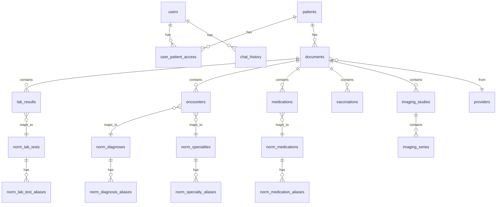

# Database Schema

Asclepius uses SQLite with WAL mode and FTS5 for full-text search. The schema is defined in `backend/asclepius/db/schema.sql`.

## Entity Relationship



## Core Tables

### users
Authentication and identity.

### patients
Medical record subjects. Each has a `slug` used as the folder name in the vault.

### user_patient_access
Many-to-many with roles (`owner` or `viewer`). Every API call checks this table.

### documents
Central table — every file ingested creates one row. Links to all extracted data.

**Status values:** `pending`, `processing`, `done`, `failed`, `needs_review`

### providers
Medical providers (doctors, hospitals, labs). Upserted during extraction.

## Extracted Data Tables

### lab_results
Individual test results with values, units, reference ranges, and abnormal flags.

### encounters
Medical encounters with diagnoses, findings, and follow-up instructions.

### medications
Prescribed medications with dosage, form, and frequency.

### vaccinations
Vaccination records with manufacturer, lot number, and dose.

### imaging_studies / imaging_series
DICOM study and series metadata for medical imaging.

## Normalization Tables

Four sets of normalization tables (lab tests, specialties, diagnoses, medications), each with a canonical table and an aliases table. See [Normalization](../user-guide/normalization.md).

## Full-Text Search

```sql
CREATE VIRTUAL TABLE documents_fts USING fts5(
    ocr_text, raw_extraction,
    content='documents', content_rowid='id'
);
```

Kept in sync via INSERT/UPDATE/DELETE triggers. Searched via `MATCH` with BM25 ranking.
