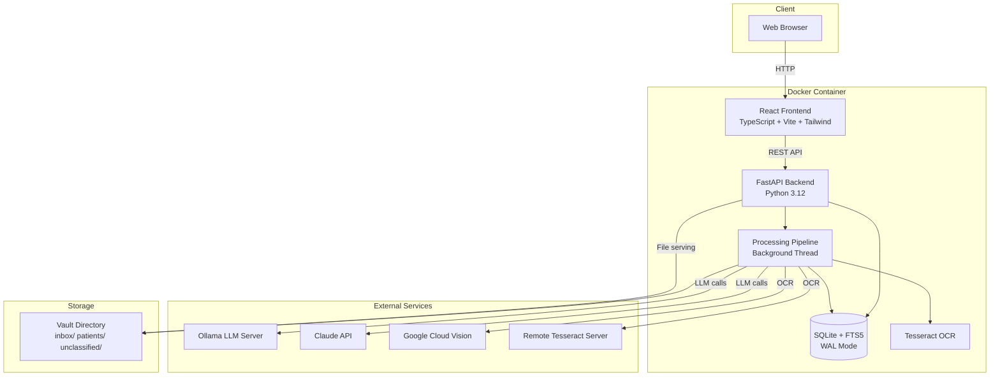

# Architecture Overview

Asclepius is a **single Docker container** application with a Python/FastAPI backend serving both the REST API and the pre-built React frontend. All LLM inference is performed by external services.

## System Diagram

## Component Responsibilities

| Component | Responsibility |
|-----------|---------------|
| **FastAPI Backend** | REST API, authentication (session + OIDC), database access, file serving, settings management |
| **React Frontend** | Web UI for browsing, searching, managing records, uploading documents, and configuring settings |
| **Processing Pipeline** | File watcher (watchdog), OCR, LLM extraction, page sectioning, file organization. Runs in a background asyncio task |
| **SQLite + FTS5** | All structured data storage with WAL mode for concurrent reads. FTS5 virtual table for full-text search |
| **Tesseract OCR** | Local OCR engine bundled in the container (5 language packs) |
| **Ollama / Claude** | External LLM providers for document classification, data extraction, chat, and AI editing |
| **Vault** | Organized file storage on the filesystem, mounted as a Docker volume |

## Request Flow

1. User interacts with the React UI in the browser
2. UI makes REST API calls to the FastAPI backend
3. Backend validates authentication via signed session cookies (or OIDC)
4. Backend checks authorization via the `user_patient_access` table
5. Backend queries SQLite and serves files from the vault

## Pipeline Flow (High Level)

1. File watcher (watchdog) detects new files in `vault/inbox/`
2. Files are queued with priority (smallest files first)
3. For each file:
    - Compute SHA-256 hash for deduplication
    - Run OCR (Tesseract, LLM Vision, Google Vision, or Remote)
    - If document >5 pages: smart page-level sectioning
    - Phase 1: Classify document type and extract basic metadata
    - Phase 2: Type-specific extraction (lab results, medications, encounters, etc.)
    - Normalize doctor/facility names, match to existing records
    - Organize file into `vault/patients/{slug}/{year}/`
4. Per-document progress tracking (step + current page) visible on Dashboard

See [Processing Pipeline](pipeline.md) for the complete flow.

## Key Design Decisions

- **No ORM** -- Raw SQL with aiosqlite for simplicity, control, and performance
- **SQLite with WAL** -- Portable, no external dependency, sufficient for single-instance. WAL mode enables concurrent reads during pipeline writes
- **Session-based auth** -- Signed cookies via itsdangerous, bcrypt password hashing. No JWTs
- **File-based storage** -- Files organized on filesystem by patient/year, metadata in DB
- **External LLMs only** -- No bundled Ollama or model downloads. The container stays lightweight; you bring your own LLM
- **Two-phase extraction** -- Classify first (cheap), then extract with type-specific prompts (accurate). This avoids sending irrelevant extraction schemas to the LLM
- **Pipeline in background thread** -- Processing never blocks the web server. Cancellation is cooperative via an in-memory set of cancelled document IDs
- **Runtime pipeline control** -- Pipeline can be started/stopped from the Settings UI at runtime via `app.state.pipeline_task`. Auto-stops after 5 consecutive provider connectivity failures
- **Settings editable at runtime** -- All configuration changes are persisted to YAML and applied to in-memory config immediately, without restart
