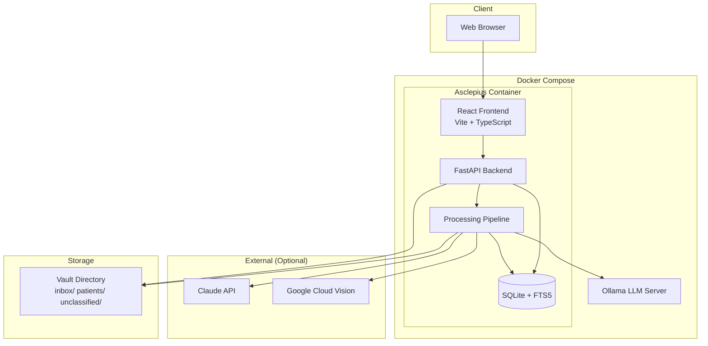

# Architecture Overview

Asclepius is a single-container application with a Python/FastAPI backend serving both the API and the React frontend.

## System Diagram

## Component Responsibilities

| Component | Responsibility |
|-----------|---------------|
| **FastAPI Backend** | REST API, authentication, database access, file serving |
| **React Frontend** | Web UI for browsing, searching, and managing records |
| **Processing Pipeline** | File watcher, OCR, LLM extraction, file organization |
| **SQLite + FTS5** | All structured data storage and full-text search |
| **Ollama** | Local LLM for document extraction and chat |
| **Vault** | Organized file storage on the filesystem |

## Request Flow

1. User interacts with the React UI
2. UI makes API calls to the FastAPI backend
3. Backend validates authentication (signed session cookies)
4. Backend checks authorization (user-patient access mapping)
5. Backend queries SQLite and serves files from the vault

## Pipeline Flow

1. File watcher (watchdog) detects new files in `vault/inbox/`
2. File type detection (PDF, image, DICOM)
3. OCR (Tesseract) for PDFs and images
4. LLM extraction (Ollama or Claude) for structured data
5. Patient matching against known patients
6. File organization into `vault/patients/{slug}/{year}/`
7. Database writes: documents, lab_results, encounters, medications, etc.

## Key Design Decisions

- **No ORM** — Raw SQL with aiosqlite for simplicity and control
- **SQLite** — Portable, no external dependency, sufficient for single-instance
- **Session-based auth** — Signed cookies via itsdangerous, bcrypt passwords
- **File-based storage** — Files organized on filesystem, metadata in DB
- **Files never move after ingestion** — Path set once, all updates are DB-only
