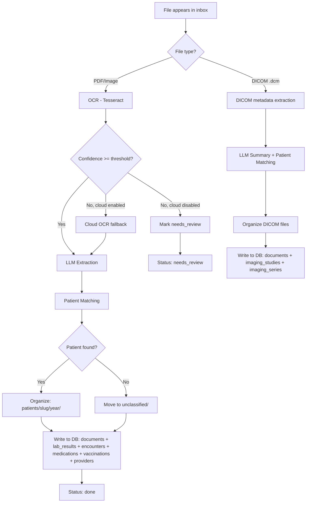

# Processing Pipeline

The pipeline automatically processes files dropped into `vault/inbox/`.

## Pipeline Flow

## Components

### File Watcher (`pipeline/watcher.py`)
Uses the `watchdog` library to monitor `vault/inbox/`. Debounces new files by 2 seconds to let uploads complete.

### OCR (`pipeline/ocr.py`)
- For PDFs: tries embedded text extraction via PyMuPDF first; falls back to page-by-page Tesseract OCR
- For images: direct Tesseract OCR
- Reports confidence score (0.0–1.0)

### LLM Extractor (`pipeline/extractor.py`)
- Builds context with known patients, providers, and normalization mappings
- Sends OCR text to the configured LLM (Ollama or Claude)
- Parses structured JSON response
- Writes extracted data to all relevant DB tables
- Resolves normalization mappings, creating new entries as needed

### File Organizer (`pipeline/organizer.py`)
Moves files from inbox to their final location:

- Pattern: `patients/{slug}/{YYYY}/{YYYY-MM-DD}_{provider}_{doctype}.{ext}`
- Handles filename conflicts by appending a counter
- Uses copy-then-delete for safety across filesystems

### DICOM Ingest (`pipeline/dicom_ingest.py`)
- Reads DICOM metadata via pydicom (without loading pixel data)
- Organizes into `patients/{slug}/{year}/imaging/{study}/series-{n}/`
- Creates imaging_studies and imaging_series records

## Document Statuses

| Status | Meaning |
|--------|---------|
| `pending` | File detected, not yet processed |
| `processing` | Currently being OCR'd or extracted |
| `done` | Fully processed, all data extracted |
| `failed` | Pipeline error, needs manual intervention |
| `needs_review` | Low OCR confidence or ambiguous extraction |

## Error Handling

- Failed documents are marked with `status = 'failed'`
- Errors are logged and tracked in the in-memory pipeline status
- The `/api/pipeline/status` endpoint shows recent errors
- Documents can be reprocessed via `POST /api/documents/{id}/reprocess`
