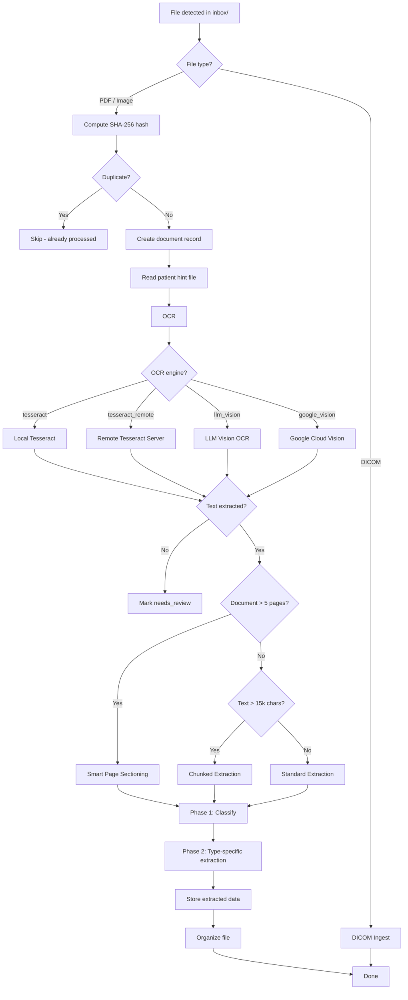
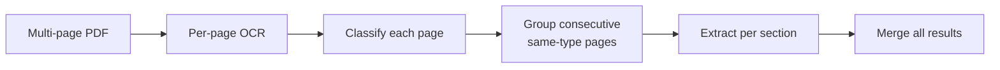

# Processing Pipeline

The pipeline is the core ingestion engine of Asclepius. It watches the inbox folder, processes files through OCR and LLM extraction, and organizes them into the vault.

## Pipeline Architecture



## File Watcher

The pipeline uses `watchdog` to monitor the `vault/inbox/` directory for new files. When a file appears:

1. It is added to a **priority queue** sorted by file size (smallest first)
2. The queue is processed sequentially (one file at a time)
3. Processing status is tracked in memory and visible on the Dashboard

Configuration:

| Setting | Default | Description |
|---------|---------|-------------|
| `pipeline.watch_enabled` | `true` | Enable/disable the file watcher |
| `pipeline.poll_interval_seconds` | `5` | How often to check for new files |
| `pipeline.retry_interval_seconds` | `300` | Wait before retrying failed extractions |
| `pipeline.max_retries` | `3` | Maximum retry attempts |

## Patient Assignment

Documents can be pre-assigned to a patient in two ways:

1. **Upload via web UI** -- selecting a patient during upload writes a `.patient_hint` file alongside the document
2. **Hint file** -- a file named `document.pdf.patient_hint` containing the patient ID (a single integer)

The pipeline reads and deletes the hint file during processing, then sets the `patient_id` on the document record.

## OCR Phase

OCR providers are configured as an ordered list in Settings. The pipeline tries each enabled provider in **priority order**, falling back to the next if a provider returns empty text or fails. All engines return `(text, confidence, provider_name)`.

The `provider_name` stored in the database is the user-configured display name (e.g., "My Remote OCR") rather than the technical engine type.

### Provider Fallback Chain

1. Try provider at priority 1
2. If empty text or error → try priority 2
3. Continue until text is extracted or all providers exhausted
4. If all fail → mark document as `needs_review`

### Tesseract (Local)

1. For PDFs: try embedded text first (from digital PDFs)
2. If embedded text is insufficient (<50 chars): render pages at 300 DPI and OCR each page
3. Calculate per-page confidence from Tesseract's word-level confidence scores
4. For large documents (>20 pages): progress tracking per page

### LLM Vision

1. Render each PDF page as a JPEG image (150 DPI, auto-downscale if >4.5MB)
2. Send each page image to the LLM (Claude, OpenAI, or Ollama with vision model)
3. LLM transcribes all visible text, preserving structure
4. Supports rate-limit retry with exponential backoff (30s, 60s, 90s)
5. Can use a **separate** provider/model/URL from the extraction LLM

### Remote Tesseract

1. Send the entire file to a remote Tesseract server via HTTP POST
2. Server returns `{"text": "...", "confidence": 0.95}`
3. Falls back to local Tesseract if the remote server fails

### Google Cloud Vision

Uses the Google Cloud Vision API for OCR. Requires an API key.

## Two-Phase Extraction

After OCR, the extracted text is sent to the LLM in two phases:

### Phase 1: Classification

A single prompt classifies the document and extracts basic metadata. The prompt is structured with the document content first and the JSON schema last (recency bias helps smaller models follow the schema).

- **Document type** (bloodtest, specialist_report, prescription, invoice, discharge, radiology_report, vaccination, surgical_report, and 15+ other types)
- **Patient name** (matched against existing patients)
- **Doctor name** (matched/created in the doctors table, with alias)
- **Facility name** (matched/created in the facilities table, with alias)
- **Dates** (doc_date, date_issued, date_visit)
- **Specialty** (normalized against the specialties table)
- **Summary** (English + source language)

When smaller LLMs return non-conforming JSON (e.g., using `responsible` instead of `doctor`), a salvage step attempts to map common alternative key names to the expected schema.

The LLM provider name and model used for extraction are stored on the document (visible under "Processing details" in the document view).

### Phase 2: Type-Specific Extraction

Based on the classified document type, a type-specific prompt extracts detailed structured data:

| Document Type | Extracted Data |
|--------------|----------------|
| `bloodtest` | Lab results (test name, value, unit, reference range, abnormal flag) |
| `specialist_report` | Encounters (diagnosis, findings, follow-up), medications |
| `prescription` | Medications (name, dosage, form, frequency, duration) |
| `invoice` | Invoice line items (description, amount, tariff code, category) |
| `discharge` | Encounters, medications, diagnoses, follow-up instructions |
| `radiology_report` | Imaging findings, diagnoses |
| `vaccination` | Vaccination records (vaccine, manufacturer, lot, dose number) |
| `surgical_report` | Encounters with operative details |

## Smart Page-Level Sectioning

For documents with more than **5 pages**, the pipeline uses smart page-level sectioning instead of sending the entire text to a single extraction prompt:



### Page Classification Types

| Type | Description |
|------|-------------|
| `lab_results_page` | Laboratory test results |
| `clinical_notes` | Doctor's clinical notes |
| `nursing_notes` | Nursing observations |
| `operative_notes` | Surgical operation details |
| `discharge_summary` | Discharge summary |
| `imaging_report` | Radiology/imaging report |
| `medication_chart` | Medication administration records |
| `vital_signs` | Vital signs monitoring |
| `consent_form` | Patient consent (skipped for extraction) |
| `cover_page` | Cover/title page (skipped for extraction) |
| `invoice_page` | Billing/invoice page |
| `correspondence` | Letters and correspondence |
| `other` | Unclassified content |

### Sectioning Process

1. **Page classification** -- Pages are sent in batches of 10 to the LLM for classification
2. **Grouping** -- Consecutive pages of the same type are merged into sections
3. **Per-section extraction** -- Each section is extracted using the appropriate type-specific prompt
4. **Section summary** -- Each section gets a brief English summary
5. **Aggregation** -- All section extractions are merged, deduplicating lab results, medications, etc.
6. **Document-level classification** -- A classification prompt runs on the first ~5000 characters for overall document metadata

Sections are stored in the `document_sections` table and are visible in the document detail page.

## Chunked Extraction

For documents that are not large enough for sectioning but have OCR text longer than **15,000 characters**, the pipeline uses chunked extraction:

1. Split text into 10,000-character chunks with 1,000-character overlap
2. Extract the first chunk normally (writes to DB)
3. Extract remaining chunks and merge results
4. Deduplication by test name, medication name, diagnosis, etc.

## Cancellation

Document processing can be cancelled at any time from the web UI:

- The API adds the document ID to an in-memory `cancelled_docs` set
- The pipeline checks this set between each processing step (OCR, LLM, organizing)
- If a cancellation is detected, the document status is set to `cancelled` and processing stops

## Name Normalization

During extraction, doctor and facility names are normalized:

1. The LLM extracts raw names from the document
2. Names are slugified and matched against existing records
3. If a match is found, the existing record is reused
4. If no match is found, a new doctor/facility record is created
5. Document type names are also normalized against fuzzy alias tables

## Progress Tracking

The pipeline maintains an in-memory status dict visible via `GET /api/pipeline/status`:

```json
{
  "queue_depth": 2,
  "processing": "document.pdf",
  "processing_step": "llm_extraction",
  "processing_doc_id": 42,
  "processing_pages": 15,
  "processing_page_current": 7,
  "last_processed": "previous.pdf",
  "total_processed": 128,
  "total_errors": 3,
  "recent_errors": [],
  "queued_files": [
    {"filename": "next.pdf", "size": 1234567}
  ]
}
```

## Runtime Pipeline Control

The pipeline can be started and stopped at runtime from the Settings UI without restarting the application:

- **Start/Stop buttons** in Settings > Pipeline tab
- `POST /api/pipeline/start` and `POST /api/pipeline/stop` endpoints (admin only)
- Toggling `pipeline_watch_enabled` in settings also starts/stops the pipeline immediately

### Auto-Stop on Provider Failures

If the pipeline encounters **5 consecutive provider connectivity failures** (connection refused, timeout, HTTP 5xx), it automatically pauses and sets an `auto_stopped` flag. A warning banner appears in the Settings UI with a "Restart" button.

Only connectivity errors trigger auto-stop — document-specific extraction failures (malformed content, unsupported format) do not.

### Extraction Validation

After LLM extraction, the pipeline validates that at least one meaningful field was produced (doc_type, summary, dates, lab results, medications, or diagnoses). If the extraction is completely empty, the document is marked `needs_review` with the error message "LLM extraction returned empty results" instead of being silently marked as `done`.
