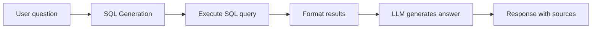

# Chat

## Overview

The Chat feature lets you ask questions about a patient's medical history using natural language. It uses RAG (Retrieval Augmented Generation) to query the structured database and provide accurate answers grounded in your actual medical records.

## How It Works

1. **SQL Generation** -- The LLM generates a SQL query from your natural language question, targeting the structured database tables (documents, lab_results, encounters, medications, etc.)
2. **Query Execution** -- The generated SQL is executed against the SQLite database
3. **Answer Generation** -- The LLM uses the query results to compose a natural language answer
4. **Source Documents** -- Every document referenced in the query result is attached to the reply as a clickable chip. Click a chip to jump to that document's detail page.

## Usage

1. Select a patient from the sidebar (optional -- chat can work across all patients you have access to)
2. Go to **Chat** in the sidebar
3. Type your question and press Enter

### Example Questions

- "What were my last cholesterol results?"
- "When was my last blood test?"
- "What medications am I currently taking?"
- "Show me all visits to Dr. Mueller"
- "What diagnoses have been made in the last year?"
- "How has my hemoglobin changed over time?"
- "When is my next follow-up appointment?"

## Chat History

Chat history is persisted per user and per patient, including the source documents attached to each assistant reply — reloading the page restores the links exactly as they were. Click **Start new chat** in the header to clear the current conversation — it removes the chat history for the active user/patient pair on the server (`DELETE /api/chat/history`) and empties the visible message list.

## Custom System Prompt

The chat system prompt and SQL generation prompt can be customized from **Settings → Document Analysis → Prompts**:

- `chat_system` -- The system prompt that defines the assistant's personality and behavior
- `sql_generation` -- The prompt that instructs the LLM how to generate SQL queries from questions

See [LLM Configuration](../admin-guide/llm-configuration.md#custom-prompts) for details.

## Limitations

- The chat queries structured data only -- it does not search raw OCR text (use Search for that)
- Complex analytical questions may produce incorrect SQL queries
- Response quality depends on the LLM model used (larger models produce better SQL)
