Asclepius keeps all structured data in SQLite, with WAL (Write-Ahead Logging) for safe concurrent reads during pipeline writes and FTS5 for full-text search. The database file lives at `vault/asclepius.sqlite`.

<svg viewBox="0 0 920 480" xmlns="http://www.w3.org/2000/svg" role="img" aria-label="Core data model" style="display:block;width:100%;height:auto;max-width:100%;">
  <defs>
    <pattern id="db-dots" width="22" height="22" patternUnits="userSpaceOnUse">
      <circle cx="1" cy="1" r="0.9" fill="rgba(28,25,23,0.10)"/>
    </pattern>
    
  </defs>
  <rect width="100%" height="100%" fill="#efeee5"/>
  <rect width="100%" height="100%" fill="url(#db-dots)" opacity="0.6"/>
  <!-- ===== Relationship lines (behind boxes) ===== -->
  <!-- patients -> documents: primary 1-N -->
  <line x1="216" y1="224" x2="360" y2="224" stroke="#57534e" stroke-width="1"/>
  <rect x="268" y="216" width="40" height="14" rx="2" fill="#efeee5"/>
  <text x="288" y="225" class="db-label" text-anchor="middle">1—N</text>
  <!-- users -> documents: uploaded_by (optional, dashed) -->
  <line x1="216" y1="96" x2="360" y2="168" stroke="#57534e" stroke-width="1" stroke-dasharray="4,3"/>
  <rect x="240" y="124" width="64" height="14" rx="2" fill="#efeee5"/>
  <text x="272" y="133" class="db-label" text-anchor="middle">UPLOADED</text>
  <!-- medical_events -> documents: M-N via document_event_links -->
  <line x1="216" y1="352" x2="360" y2="328" stroke="#57534e" stroke-width="1" stroke-dasharray="4,3"/>
  <rect x="240" y="332" width="68" height="14" rx="2" fill="#efeee5"/>
  <text x="274" y="341" class="db-label" text-anchor="middle">M—N LINKS</text>
  <!-- documents -> right-side medical data tables (all 1-N) -->
  <line x1="560" y1="176" x2="704" y2="88"  stroke="#57534e" stroke-width="1"/>
  <line x1="560" y1="216" x2="704" y2="192" stroke="#57534e" stroke-width="1"/>
  <line x1="560" y1="280" x2="704" y2="296" stroke="#57534e" stroke-width="1"/>
  <line x1="560" y1="328" x2="704" y2="400" stroke="#57534e" stroke-width="1"/>
  <rect x="608" y="132" width="40" height="14" rx="2" fill="#efeee5"/>
  <text x="628" y="141" class="db-label" text-anchor="middle">1—N</text>
  <!-- ===== users ===== -->
  <rect x="40" y="56"  width="176" height="80" rx="6" fill="#faf7f2"/>
  <rect x="40" y="56"  width="176" height="80" rx="6" fill="#ffffff" stroke="#1c1917" stroke-width="1"/>
  <rect x="48" y="64"  width="44" height="14" rx="2" fill="transparent" stroke="rgba(28,25,23,0.40)" stroke-width="0.8"/>
  <text x="70"  y="74"  class="db-eyebrow" fill="rgba(28,25,23,0.8)" text-anchor="middle">USERS</text>
  <text x="128" y="100" class="db-name"  text-anchor="middle">users</text>
  <text x="128" y="116" class="db-field" text-anchor="middle">id · username · role</text>
  <text x="128" y="128" class="db-field" text-anchor="middle">password_hash</text>
  <!-- ===== patients (focal) ===== -->
  <rect x="40" y="180" width="176" height="88" rx="6" fill="#faf7f2"/>
  <rect x="40" y="180" width="176" height="88" rx="6" fill="rgba(142,68,73,0.10)" stroke="#8E4449" stroke-width="1.2"/>
  <rect x="48" y="188" width="56" height="14" rx="2" fill="transparent" stroke="rgba(142,68,73,0.50)" stroke-width="0.8"/>
  <text x="76"  y="198" class="db-eyebrow" fill="#8E4449" text-anchor="middle">PATIENT</text>
  <text x="128" y="224" class="db-name"  text-anchor="middle">patients</text>
  <text x="128" y="240" class="db-field" text-anchor="middle">id · slug · display_name</text>
  <text x="128" y="252" class="db-field" text-anchor="middle">date_of_birth · sex</text>
  <!-- ===== medical_events ===== -->
  <rect x="40" y="312" width="176" height="80" rx="6" fill="#faf7f2"/>
  <rect x="40" y="312" width="176" height="80" rx="6" fill="rgba(28,25,23,0.05)" stroke="#57534e" stroke-width="1"/>
  <rect x="48" y="320" width="56" height="14" rx="2" fill="transparent" stroke="rgba(87,83,78,0.40)" stroke-width="0.8"/>
  <text x="76"  y="330" class="db-eyebrow" fill="rgba(87,83,78,0.9)" text-anchor="middle">EVENTS</text>
  <text x="128" y="356" class="db-name"  text-anchor="middle">medical_events</text>
  <text x="128" y="372" class="db-field" text-anchor="middle">title · type · date range</text>
  <text x="128" y="384" class="db-field" text-anchor="middle">+ document_event_links</text>
  <!-- ===== documents (focal, hub) ===== -->
  <rect x="360" y="136" width="200" height="224" rx="6" fill="#faf7f2"/>
  <rect x="360" y="136" width="200" height="224" rx="6" fill="rgba(142,68,73,0.10)" stroke="#8E4449" stroke-width="1.2"/>
  <rect x="368" y="144" width="48" height="14" rx="2" fill="transparent" stroke="rgba(142,68,73,0.50)" stroke-width="0.8"/>
  <text x="392" y="154" class="db-eyebrow" fill="#8E4449" text-anchor="middle">CORE</text>
  <text x="460" y="184" class="db-name-lg" text-anchor="middle">documents</text>
  <text x="460" y="208" class="db-field" text-anchor="middle">id · patient_id · file_path</text>
  <text x="460" y="220" class="db-field" text-anchor="middle">file_hash · doc_type</text>
  <text x="460" y="232" class="db-field" text-anchor="middle">doc_date · status</text>
  <text x="460" y="244" class="db-field" text-anchor="middle">ocr_text · raw_extraction</text>
  <text x="460" y="256" class="db-field" text-anchor="middle">ocr_engine · llm_provider</text>
  <text x="460" y="268" class="db-field" text-anchor="middle">uploaded_by_user_id</text>
  <text x="460" y="280" class="db-field" text-anchor="middle">doctor_id · facility_id</text>
  <text x="460" y="292" class="db-field" text-anchor="middle">event_id · summary_en</text>
  <text x="460" y="304" class="db-field" text-anchor="middle">user_notes · tags</text>
  <text x="460" y="324" class="db-field" text-anchor="middle">+ documents_fts (FTS5)</text>
  <text x="460" y="344" class="db-field" text-anchor="middle">+ document_sections · links</text>
  <!-- ===== lab_results ===== -->
  <rect x="704" y="48"  width="176" height="80" rx="6" fill="#faf7f2"/>
  <rect x="704" y="48"  width="176" height="80" rx="6" fill="#ffffff" stroke="#1c1917" stroke-width="1"/>
  <rect x="712" y="56"  width="40" height="14" rx="2" fill="transparent" stroke="rgba(28,25,23,0.40)" stroke-width="0.8"/>
  <text x="732" y="66"  class="db-eyebrow" fill="rgba(28,25,23,0.8)" text-anchor="middle">LABS</text>
  <text x="792" y="92"  class="db-name"  text-anchor="middle">lab_results</text>
  <text x="792" y="108" class="db-field" text-anchor="middle">value · unit · ranges</text>
  <text x="792" y="120" class="db-field" text-anchor="middle">norm_lab_test_id</text>
  <!-- ===== medications ===== -->
  <rect x="704" y="152" width="176" height="80" rx="6" fill="#faf7f2"/>
  <rect x="704" y="152" width="176" height="80" rx="6" fill="#ffffff" stroke="#1c1917" stroke-width="1"/>
  <rect x="712" y="160" width="32" height="14" rx="2" fill="transparent" stroke="rgba(28,25,23,0.40)" stroke-width="0.8"/>
  <text x="728" y="170" class="db-eyebrow" fill="rgba(28,25,23,0.8)" text-anchor="middle">RX</text>
  <text x="792" y="196" class="db-name"  text-anchor="middle">medications</text>
  <text x="792" y="212" class="db-field" text-anchor="middle">brand · ingredient</text>
  <text x="792" y="224" class="db-field" text-anchor="middle">dosage · frequency</text>
  <!-- ===== encounters ===== -->
  <rect x="704" y="256" width="176" height="80" rx="6" fill="#faf7f2"/>
  <rect x="704" y="256" width="176" height="80" rx="6" fill="#ffffff" stroke="#1c1917" stroke-width="1"/>
  <rect x="712" y="264" width="52" height="14" rx="2" fill="transparent" stroke="rgba(28,25,23,0.40)" stroke-width="0.8"/>
  <text x="738" y="274" class="db-eyebrow" fill="rgba(28,25,23,0.8)" text-anchor="middle">VISITS</text>
  <text x="792" y="300" class="db-name"  text-anchor="middle">encounters</text>
  <text x="792" y="316" class="db-field" text-anchor="middle">diagnosis · findings</text>
  <text x="792" y="328" class="db-field" text-anchor="middle">follow-up</text>
  <!-- ===== imaging_studies ===== -->
  <rect x="704" y="360" width="176" height="80" rx="6" fill="#faf7f2"/>
  <rect x="704" y="360" width="176" height="80" rx="6" fill="#ffffff" stroke="#1c1917" stroke-width="1"/>
  <rect x="712" y="368" width="56" height="14" rx="2" fill="transparent" stroke="rgba(28,25,23,0.40)" stroke-width="0.8"/>
  <text x="740" y="378" class="db-eyebrow" fill="rgba(28,25,23,0.8)" text-anchor="middle">IMAGING</text>
  <text x="792" y="404" class="db-name"  text-anchor="middle">imaging_studies</text>
  <text x="792" y="420" class="db-field" text-anchor="middle">modality · body_part</text>
  <text x="792" y="432" class="db-field" text-anchor="middle">+ imaging_series · DICOM</text>
</svg>

The diagram above is the core hub-and-spoke shape: `documents` in the middle, `patients` as the access boundary, and the medical-data tables (`lab_results`, `medications`, `encounters`, `imaging_studies`) hanging off both. Normalization tables (`norm_lab_tests`, etc.), audit logs, sessions, FTS triggers, and the per-page OCR cache are documented in the **Table Details** section below.

```mermaid
erDiagram
    users ||--o{ user_patient_access : has
    patients ||--o{ user_patient_access : has
    patients ||--o{ documents : has
    patients ||--o{ lab_results : has
    patients ||--o{ encounters : has
    patients ||--o{ medications : has
    patients ||--o{ vaccinations : has
    patients ||--o{ imaging_studies : has
    patients ||--o{ medical_events : has

    documents ||--o{ lab_results : contains
    documents ||--o{ encounters : contains
    documents ||--o{ medications : contains
    documents ||--o{ vaccinations : contains
    documents ||--o{ imaging_studies : contains
    documents ||--o{ invoice_items : contains
    documents ||--o{ document_links : source
    documents ||--o{ document_links : target
    documents ||--o{ document_event_links : linked
    documents ||--o{ document_sections : has

    medical_events ||--o{ document_event_links : linked

    doctors ||--o{ doctor_aliases : has
    doctors ||--o{ documents : referenced
    doctors ||--o{ encounters : referenced
    doctors ||--o{ imaging_studies : referenced
    facilities ||--o{ facility_aliases : has
    facilities ||--o{ documents : referenced
    facilities ||--o{ doctors : belongs_to
    facilities ||--o{ encounters : referenced
    facilities ||--o{ imaging_studies : referenced

    imaging_studies ||--o{ imaging_series : contains

    norm_lab_tests ||--o{ norm_lab_test_aliases : has
    norm_lab_tests ||--o{ lab_results : normalizes
    norm_specialties ||--o{ norm_specialty_aliases : has
    norm_diagnoses ||--o{ norm_diagnosis_aliases : has
    norm_medications ||--o{ norm_medication_aliases : has

    users ||--o{ chat_history : has
    users ||--o{ sessions : has
    users ||--o{ documents : uploaded

    users {
        int id PK
        text username UK
        text password_hash
        text display_name
        text role
        datetime created_at
    }

    sessions {
        text id PK
        int user_id FK
        datetime created_at
        datetime expires_at
        datetime last_seen_at
        text user_agent
        text ip_address
    }

    audit_log {
        int id PK
        datetime timestamp
        int user_id FK
        text event
        text target_type
        text target_id
        text details
    }

    ocr_page_cache {
        int document_id FK
        int page_number
        text ocr_text
        text ocr_engine
        real confidence
    }

    patients {
        int id PK
        text slug UK
        text display_name
        date date_of_birth
        text sex
    }

    user_patient_access {
        int user_id FK
        int patient_id FK
        text role
    }

    documents {
        int id PK
        int patient_id FK
        int uploaded_by_user_id FK
        text file_path
        text original_filename
        text suggested_filename
        text doc_type
        date doc_date
        int doctor_id FK
        text doctor_name
        int facility_id FK
        text facility_name
        int norm_specialty_id FK
        text specialty_original
        date date_issued
        date date_visit
        date date_received
        text summary_en
        text summary_original
        int event_id FK
        text notes
        text user_notes
        text tags
        int page_count
        int file_size
        text file_hash UK
        text ocr_text
        real ocr_confidence
        text ocr_engine
        text llm_provider
        text processing_flow
        json raw_extraction
        text status
        text error_message
        int retry_count
    }

    medical_events {
        int id PK
        int patient_id FK
        text title
        text event_type
        text description
        date date_start
        date date_end
        bool is_ongoing
        text severity
        text diagnosis_text
        text icd10_code
        text specialty_text
        text notes
        text color
    }

    document_event_links {
        int id PK
        int document_id FK
        int event_id FK
        text relevance
        bool auto_linked
    }

    document_sections {
        int id PK
        int document_id FK
        int section_index
        int page_start
        int page_end
        text section_type
        text ocr_text
        json raw_extraction
        text summary_en
    }

    document_links {
        int id PK
        int source_document_id FK
        int target_document_id FK
        text link_type
    }

    facilities {
        int id PK
        text name
        text slug UK
        text canonical_code UK
        text canonical_display
        text type
        text address
        text city
        text country
        text phone
        text email
        text website
    }

    facility_aliases {
        int id PK
        int facility_id FK
        text alias
        text language
        bool auto_mapped
    }

    doctors {
        int id PK
        text name
        text slug UK
        text canonical_code UK
        text canonical_display
        text title
        int norm_specialty_id FK
        int facility_id FK
        text phone
        text email
    }

    doctor_aliases {
        int id PK
        int doctor_id FK
        text alias
        text language
        bool auto_mapped
    }

    lab_results {
        int id PK
        int document_id FK
        int patient_id FK
        text test_name_original
        int norm_lab_test_id FK
        real value
        text value_text
        text unit
        real reference_range_low
        real reference_range_high
        bool is_abnormal
        text sample_type
        text panel_name
        date test_date
    }

    encounters {
        int id PK
        int document_id FK
        int patient_id FK
        int doctor_id FK
        int facility_id FK
        date encounter_date
        date admission_date
        date discharge_date
        int norm_diagnosis_id FK
        text diagnosis_original
        text findings
        text notes
        date follow_up_date
        text follow_up_instructions
    }

    medications {
        int id PK
        int document_id FK
        int patient_id FK
        int norm_medication_id FK
        text brand_name
        text active_ingredient_original
        text dosage
        text form
        text frequency
        text duration
        text quantity
        date prescribed_date
    }

    vaccinations {
        int id PK
        int document_id FK
        int patient_id FK
        text vaccine_name
        text manufacturer
        text lot_number
        int dose_number
        date date_administered
    }

    imaging_studies {
        int id PK
        int document_id FK
        int patient_id FK
        text modality
        text body_part
        text study_description
        date study_date
        bool is_dicom
        text folder_path
    }

    imaging_series {
        int id PK
        int study_id FK
        int series_number
        text series_description
        text modality
        int num_images
    }

    invoice_items {
        int id PK
        int document_id FK
        int patient_id FK
        text description
        real quantity
        real unit_price
        real amount
        text currency
        text tariff_code
        text category
    }

    chat_history {
        int id PK
        int user_id FK
        int patient_id FK
        text role
        text content
    }

    custom_prompts {
        int id PK
        text prompt_key UK
        text prompt_text
        text description
    }
```

Full Entity-Relationship Diagram (mermaid source)

## Table Details

### Core Tables

| Table | Purpose |
|-------|---------|
| `users` | User accounts with bcrypt password hashes |
| `patients` | Patient demographics; deliberately minimal (name, DOB, sex) since only those fields are passed to the LLM for extraction |
| `user_patient_access` | Maps users to patients with role (`owner` or `viewer`) |
| `documents` | Central document records with metadata, OCR text, and extraction results |

### Medical Data Tables

| Table | Purpose |
|-------|---------|
| `lab_results` | Individual lab test results with values, units, and reference ranges |
| `encounters` | Clinical encounters with diagnoses, findings, and follow-up instructions |
| `medications` | Prescribed medications with dosage, frequency, and duration |
| `vaccinations` | Vaccination records with manufacturer, lot number, and dose |
| `imaging_studies` | Imaging study metadata (modality, body part, DICOM info) |
| `imaging_series` | Individual series within an imaging study |
| `invoice_items` | Line items from medical invoices with amounts and tariff codes |

### Organization Tables

| Table | Purpose |
|-------|---------|
| `medical_events` | Medical events (diagnosis, surgery, treatment) that group related documents |
| `document_event_links` | Many-to-many links between documents and events with relevance level |
| `document_links` | Direct links between related documents (e.g., invoice_for, follow_up) |
| `document_sections` | Page-level sections for large documents with per-section OCR and extraction |
| `facilities` | Healthcare facilities (hospitals, clinics, labs) with normalization support |
| `facility_aliases` | Name aliases for facilities (for normalization/merge) |
| `doctors` | Doctors with specialty and facility affiliation, with normalization support |
| `doctor_aliases` | Name aliases for doctors (for normalization/merge) |

### Normalization Tables

| Table | Purpose |
|-------|---------|
| `norm_lab_tests` + `norm_lab_test_aliases` | Canonical lab test names with multi-language aliases |
| `norm_specialties` + `norm_specialty_aliases` | Medical specialties with aliases |
| `norm_diagnoses` + `norm_diagnosis_aliases` | Diagnosis codes (ICD-10) with aliases |
| `norm_medications` + `norm_medication_aliases` | Medication names (ATC codes) with aliases |

### Learning Tables

| Table | Purpose |
|-------|---------|
| `extraction_corrections` | Tracks user edits to LLM-extracted fields (before/after values) for correction-driven learning |

### System Tables

| Table | Purpose |
|-------|---------|
| `chat_history` | Persisted chat messages per user and patient |
| `custom_prompts` | User-customized LLM prompts (overrides defaults) |
| `documents_fts` | FTS5 virtual table for full-text search across OCR text and raw extractions |
| `sessions` | Server-side session records (id, user, IP, user-agent, last-seen, expiry). Backs the admin session-list / revoke UI and replaces the older cookie-only session model. |
| `audit_log` | Structured audit trail for admin actions (user create/delete, session revoke, settings mutations). Surfaced in the Settings → Audit Log view. |
| `ocr_page_cache` | Per-page OCR text keyed by `(document_id, page_number)`. Populated during OCR so the extractor and chunking pipeline can read individual pages without re-running OCR. |

### Configuration (not in the database)

Shared credentials (URL + API key + concurrency + retry policy) and LLM/OCR/Vision provider entries live in `config/settings.yaml`, not the SQLite database. Asclepius mutates that file at runtime when you edit providers/credentials from the UI. There is no `credentials` or `providers` table.

## Key Design Notes

- **Deduplication.** Documents have a unique `file_hash` (SHA-256) to prevent duplicate imports.
- **Denormalized names.** `documents.doctor_name` and `documents.facility_name` store the raw extracted names alongside normalized `doctor_id`/`facility_id` foreign keys.
- **Cascading deletes.** Deleting a document cascades to all child records (lab results, encounters, medications, etc.).
- **FTS triggers.** Insert/update/delete triggers keep the FTS5 index in sync with the documents table automatically.
- **WAL mode.** Enabled at connection time for concurrent reads during pipeline writes.
